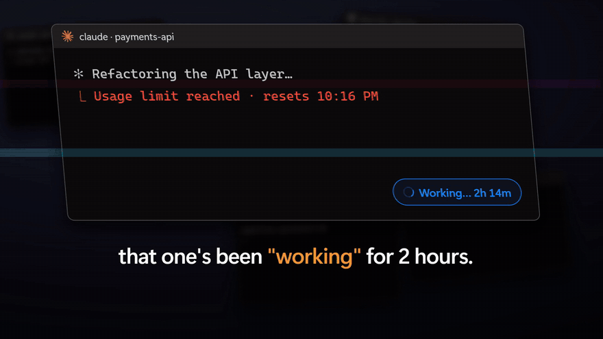

<div align="center">

# Agent Notch

**All your coding agents. One notch.**

A Dynamic-Island-style notch for Windows that shows what every coding agent is doing, which ones need you, and lets you answer them without hunting for the terminal.

[](https://github.com/KurianJose7586/notch/releases/download/v0.2.0/AgentNotch-promo.mp4)

[**Watch the 51s demo**](https://github.com/KurianJose7586/notch/releases/download/v0.2.0/AgentNotch-promo.mp4) · [**Download for Windows**](https://github.com/KurianJose7586/notch/releases/latest)

</div>

## Works with

| Agent | Where |
|---|---|
| Claude Code | terminal and the Claude desktop app |
| Antigravity | `agy` CLI and the Antigravity IDE |
| OpenCode | terminal |
| Kilo | terminal |
| GitHub Copilot | VS Code agent chat |

## Features

- **One glance**: every agent grouped by project, with its state (working, needs you, done, stopped), current task, last action and progress.
- **Needs you?** The notch glows and peeks the request. Press **Y** to allow or **N** to deny, or jump straight to that terminal.
- **AUTO for Antigravity**: presses Enter on `agy`'s permission prompts for you, only when the prompt is actually on screen.
- **Approve from your phone**: switch it on in Setup, scan the QR code, and your phone shows the same request with big **Allow** / **Deny** buttons, buzzing when an agent needs you.
- **Grid**: one click (or **Ctrl+Alt+G**) tiles every agent window.
- **Usage limits**: Claude's 5-hour and weekly limits as bars, with a heads-up at 80% and 95%. An agent that hits a limit or an error shows **Stopped**, not "Working".
- **Launch agents** from the notch: several at once, including several of the same one (a − / + stepper per provider, up to 8), optionally each in its own git worktree. Turn on **SPLIT** and every line you type becomes its own agent with its own task.
- **Updates itself**: it checks GitHub for a new release every few hours, downloads it quietly, tells you when it's ready, and installs it when you quit.
- **Rename** sessions, unread markers, timers, sound, and a full keyboard mode.
- **Alive**: after a long quiet spell the notch gets up to mischief: the agents try to escape and black tendrils grab them back, Pac-Man eats their dots, or they juggle. Press **Ctrl+Alt+V** to play the next one. A closed, quiet notch also grows eyes that follow your cursor when it lingers nearby, and reacts to what happens: a happy squish when everything finishes, a grumpy shake when an agent stops or Claude is nearly out, and an impatient nudge if a request waits. All of it stays off while anything is working, stops the moment you touch the notch, and can be turned off in Setup (**Idle animations**).
- **Starts itself** when an agent starts, and uses about 0.4% CPU when idle.

## Install

1. Download `AgentNotch-Setup-<version>.exe` from the [latest release](https://github.com/KurianJose7586/notch/releases/latest) and run it. It installs for your user only; no admin needed.
2. The first run opens a setup sheet: switch on the agents you use.
3. Start an agent. It shows up in the notch.

The installer isn't code-signed yet, so Windows SmartScreen may say "Windows protected your PC". Click **More info → Run anyway**.

### Already installed?

Download the latest installer and run it. It updates in place and keeps your settings and connected agents. **Versions before 0.3.0 can't update themselves, so this one manual step is needed once.** From 0.3.0 on, new versions arrive on their own: an "Update ready" notice appears in the notch, and the update installs when you quit (or click **Restart now**). You can turn the automatic check off in **Setup**; **Check now** still works.

Requirements: Windows 10 or 11. Terminal agents are found in Windows Terminal or any console window.

## Keyboard

| Anywhere | |
|---|---|
| **Ctrl+Alt+N** | Open the notch with the keyboard |
| **Ctrl+Alt+J** | Jump to the next agent that needs you |
| **Ctrl+Alt+G** | Tile all agent windows |
| **Ctrl+Alt+R** | Reload the notch |
| **Ctrl+Alt+V** | Play an idle animation (press again for the next one) |
| **Ctrl+Alt+Q** | Quit (agents won't restart it) |

| In the notch | |
|---|---|
| **↑ ↓** | Select an agent |
| **↵** | Open its terminal |
| **Y / N** | Allow / deny its request |
| **A** | Toggle AUTO |
| **R / D** | Rename / dismiss |
| **+** | New agent |
| **G / C** | Tile windows / clear finished |
| **S / ,** | Sound on or off / Setup |
| **I** | All shortcuts |

## Approve from your phone


Off by default. Turn it on in **Setup → Approve from your phone** and scan the QR code with your phone's camera. It opens a small web page from your PC, so there is no app to install and nothing goes through the internet.

- Works on the same Wi-Fi as your PC. Windows may ask to let Agent Notch through the firewall the first time: choose **Private networks**.
- The link contains a secret token. Anyone on your network who has it can approve requests, so don't share it. **New link** in Setup replaces the token and cuts off every phone paired before.
- The phone can only allow or deny requests that are waiting right now, and can't do anything else. Requests wait up to 55 seconds for an answer while this is on (30 otherwise); after that the agent asks in its own terminal as usual.
- Buzzing works on Android. iPhones show the request but can't vibrate a web page.
- It listens on port 47801. The hook server agents talk to stays on `127.0.0.1` only.

## What connecting an agent changes

Each switch in Setup adds (or removes) one hook in that agent's own config, and keeps a `.bak` copy of the file the first time. Nothing else is touched.

| Agent | File |
|---|---|
| Claude Code | `~/.claude/settings.json` |
| Antigravity (CLI and IDE) | `~/.gemini/config/hooks.json` |
| OpenCode | `~/.config/opencode/plugins/agent-notch.js` |
| Kilo | `~/.config/kilo/plugins/agent-notch.js` |
| VS Code Copilot | `~/.copilot/hooks/agent-notch.json` |

**Claude usage limits** is a separate switch in Setup. It uses Claude Code's status line, and is never turned on over a status line you've set up yourself. The desktop app doesn't report limits, so they update from Claude Code in a terminal.

Everything stays on your machine: agents talk to the notch over `127.0.0.1` only. The one thing that leaves your PC is the update check, which asks GitHub for the latest release.

Uninstalling removes all of these hooks before deleting the app.

## Run from source

Needs Node 20+.

```bash
npm run setup          # install dependencies, connect every agent found, start the notch
npm start              # start it again later
npm test               # self-tests
npm run remove-hooks   # disconnect every agent
```

## Build and release

```bash
npm run dist           # builds dist/AgentNotch-Setup-<version>.exe
```

To publish a release, push a version tag. GitHub Actions builds the installer on Windows and attaches it to a release for that tag; the tag sets the version.

```bash
git tag v0.3.0
git push origin v0.3.0
```

## Repository layout

| Path | What |
|---|---|
| `main.js` | Electron main process: the notch window, local event server, shortcuts |
| `index.html`, `preload.js` | The notch UI |
| `state.js` | Turns each agent's hook events into one session model |
| `hook.js`, `plugin.js` | What agents run: the hook script, and the OpenCode/Kilo plugin |
| `phone.js`, `phone.html` | Approve from your phone: the Wi-Fi server, pairing token, and the phone page |
| `setup.js` | Connects and disconnects agents' configs |
| `launch.js` | Launches agents (and git worktrees) in Windows Terminal |
| `win.ps1` | Win32 helpers: find, focus, tile, read and press Enter in terminal windows |
| `boot.js` | Entry point that routes to the app, the hook, or the uninstaller |
| `build/` | Installer icon, NSIS script and the hook launcher |
| `promo/` | Source of the demo video, made with [HyperFrames](https://hyperframes.heygen.com) |
| `docs/` | README media |

## License

[MIT](LICENSE)
